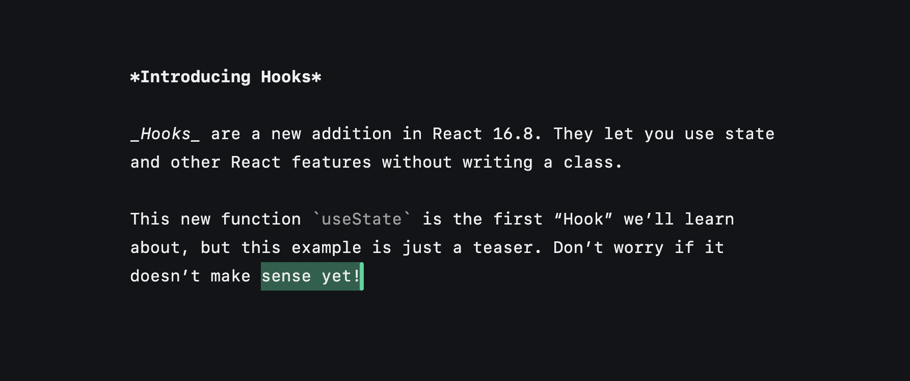

# Jade

Jade is a performant and simple plain text editor which runs and saves it's state on Deta Space.

Jade is a fork of [Gem](https://github.com/tanishqkancharla/gem), originally hand-crafted by Tanishq Kancharla. It's built on top of [prosemirror](https://prosemirror.net/).

The goods:

- Fairly lightweight.
- Undo/redo.
- Arrow key movement.
- Basic inline markdown (bold, code, italic), although they can be a little buggy.
- JS source is small and readable.
- CSS source is small and readable. Uses CSS variables for styling.
- Accessible and semantic. Each paragraph becomes a `p` tag, each inline style is appropriately represented.
- Playful animated cursor :)

To run: `npm run dev`. The build step uses **estrella** to bundle and **serve** for serving.

Make sure to follow the original author on [Twitter](https://twitter.com/moonriseTK), he posts some cool stuff.

Contributions are welcome! Here's Tanishq's original wishlist:

- Switch to using codemirror so that syntax highlighting becomes easier to dispatch
- Basic markdown syntax highlighting.
  - Headings
  - Bullet lists
  - Numbered lists
  - Code block
- Code block syntax highlighting (async loading through prismjs?)
- Cursor shape changes when marks are applied (fatter when bold, slant when italic, rectangle when code)
- Default word-selection (when you start highlighting, it defaults to selecting the whole word your cursor is on).
- Fix sentence-wrapping bug where it overflows sometimes (unreproducible as of yet, unless you paste in a huge text).
- Highlight and animate selection through 3 divs: one on bottom to beginning of line, one sandwiched in b/w, and one from top to end of line
- "Bookmarks" to leave your cursor in a position and travel back to.
- Table of contents generated from the headings for easy navigation?
- Tree-sitter for incremental markdown parsing? Prosemirror plugin to wrap the wasm bundle?
- Allow theming/setting the color variables in UI?
- Potentially replace prosemirror-view to be more lightweight and integrate cursor and selection "natively"?
- Share urls to save?
